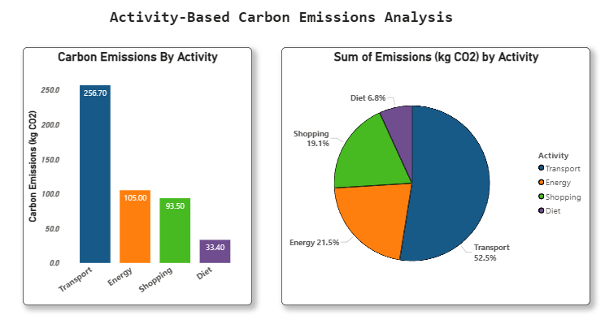
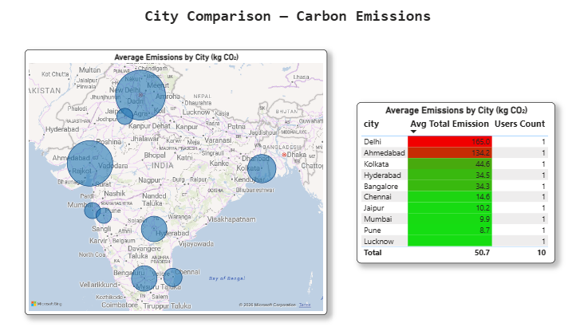
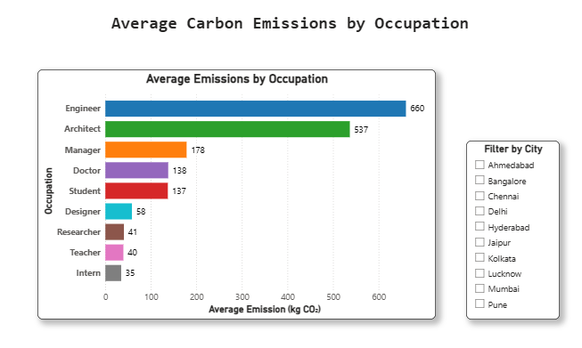

# 🌍 Carbon Footprint Tracker

This project is my attempt to combine **SQL** and **Power BI** to analyze and visualize everyday carbon emissions.  

The goal is to build something practical, yet simple enough to share on GitHub and in my portfolio.

I focused on using **SQL for data processing** and **Power BI for dashboards**, so the project flows like a real-world data pipeline.

---

## 📂 Project Structure

   
CarbonFootprintTracker/

│── data/

│ ├── raw_data.csv # Collected or mock dataset (transport, energy, etc.)

│ ├── merged_data.csv # Processed dataset for analysis

│

│── sql/

│ ├── schema.sql # Table creation script

│ ├── insert_data.sql # Sample insert queries

│ ├── queries.sql # SQL queries for insights

│
│── powerbi/

│ ├── carbon_dashboard.pbix # Power BI report file

│ ├── screenshots/ # Exported PNGs of dashboard pages

│

│── reports/

│ ├── project_report.pdf # Final project report

│ ├── architecture.png # Project architecture diagram

│
│── .gitignore

│── LICENSE

│── README.md

---

## 📊 Data

The dataset is **mock data** created for learning purposes.  
It contains attributes like:

- 🚗 Transport mode (car, bus, train, etc.)
- ⚡ Energy usage
- 🏙️ City
- 👔 Occupation
- 🌱 Lifestyle factors (diet, etc. – optional)

`raw_data.csv` → initial dataset  
`merged_data.csv` → processed dataset ready for analysis

---

## 🗄️ SQL Part

- **`schema.sql`** → Creates the tables.  
- **`merge.sql`** → Creates the merged query.  
- **`analysis_queries.sql`** → Contains queries for insights, e.g.:
  - Average emissions per city  
  - Occupation vs emission levels  
  - Transportation contribution  

---

## 📈 Power BI Dashboards

The Power BI file (`carbon_dashboard.pbix`) has multiple pages:

1. **Overview** → Total emissions by activity  
2. **City Comparison** → Map + table for city-wise emissions  
3. **Occupation Analysis** → Clustered bar chart + city slicer  

👉 Screenshots of dashboards are in `/powerbi/screenshots`.

---

## 🚀 How to Run

1. Clone the repository  
2. Load SQL scripts into your database  
3. Open `carbon_dashboard.pbix` in Power BI  
4. Replace data source with your database or `merged_data.csv`  
5. Explore the dashboards 🎉  

---

## 📸 Dashboard Previews

| Overview | City Comparison | Occupation Analysis |
|----------|----------------|----------------------|
|  |  |  |

---

## 📑 Report & Architecture

- [Project Report (PDF)](docs/project_report.pdf)  
- [Architecture Diagram](docs/architecture.png)  

---

## 📝 What I Learned

- How to design a clean **project structure** with SQL, data, and Power BI files.  
- Writing **SQL queries** for grouping, aggregation, and comparison.  
- Building **interactive dashboards in Power BI** (maps, slicers, charts).  
- The importance of keeping data **organized and reusable** (raw vs processed).  
- How to document a project properly so it’s **portfolio-ready for GitHub**.

## 📜 License

This project is licensed under the **MIT License** – feel free to use it for learning or your own projects.  

---

✨ *Made with SQL + Power BI to understand sustainability data better.*

Created by Jovin Ryan Samuel 💫
